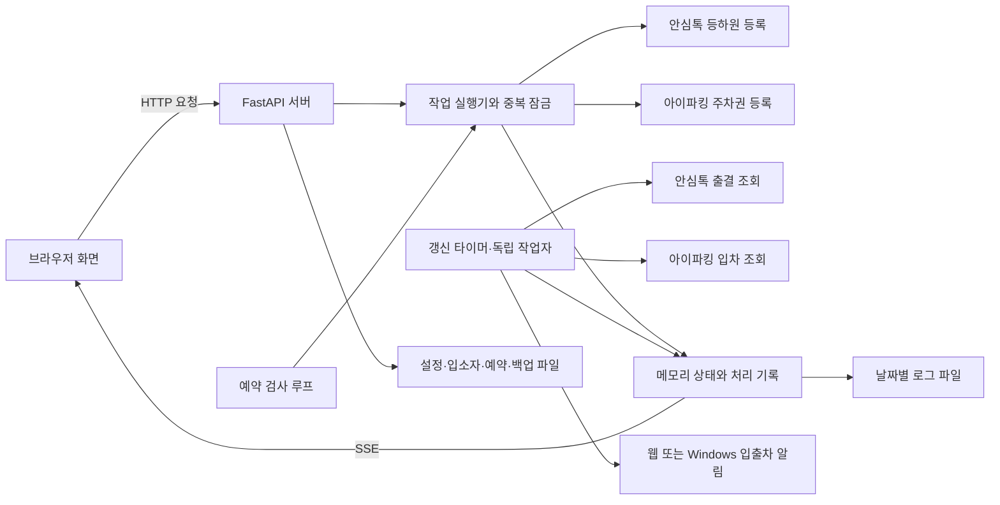

# 등하원차량등록 — 동작 명세

> 기준: 2026-09-11 현재 작업 폴더의 구현. `version.py`의 버전은 `1.4.0`이며,
> 이 문서는 해당 릴리스의 변경 이력이 아니라 현재 코드를 설명한다.

**목차**

1. [앱 개요](#1-앱-개요)
2. [시스템 구성과 시작 흐름](#2-시스템-구성과-시작-흐름)
3. [화면 구성과 표시 규칙](#3-화면-구성과-표시-규칙)
4. [수동 처리 알고리즘](#4-수동-처리-알고리즘)
5. [자동 갱신과 입출차 판정](#5-자동-갱신과-입출차-판정)
6. [예약 실행](#6-예약-실행)
7. [알림과 처리 기록](#7-알림과-처리-기록)
8. [데이터와 기본 설정](#8-데이터와-기본-설정)
9. [백업 및 복원 알고리즘](#9-백업-및-복원-알고리즘)
10. [주요 API와 실시간 이벤트](#10-주요-api와-실시간-이벤트)
11. [배포·운영 및 검증](#11-배포운영-및-검증)

## 1. 앱 개요

입소자의 등하원을 안심톡에 등록하고, 입차된 차량에 아이파킹 주차권을 적용하는
Windows용 로컬 웹 앱이다. 브라우저가 화면을 제공하고, PC에서 실행되는 Python
서버가 외부 서비스 조회·등록·예약 실행·파일 저장을 담당한다.

| 항목 | 현재 동작 |
| --- | --- |
| 앱 이름 | 등하원차량등록 / 프로젝트명 `auto-ansimtalk` |
| 접속 주소 | `http://localhost:5000` |
| 서버 바인딩 | `127.0.0.1:5000` |
| 주요 사용 환경 | Windows, 1920×1080 모니터, 입소자 최대 30명 운영을 고려한 화면 |
| 서버 | Python, FastAPI, Uvicorn |
| 화면 | Jinja2, Alpine.js, Tailwind CSS, 별도 UI CSS·JavaScript |
| 데이터 저장 | 로컬 JSON 및 날짜별 JSONL 파일 |
| 실시간 전달 | SSE(Server-Sent Events), 페이지당 연결 1개 |
| 외부 연동 | 안심톡 등하원 등록·출결 조회, 아이파킹 입차 조회·할인 등록 |

CSS와 JavaScript는 로컬 파일로 제공한다. 화면 자원을 가져오기 위한 CDN 연결은
필요 없지만, 안심톡·아이파킹 연동과 업데이트에는 인터넷 연결이 필요하다.

## 2. 시스템 구성과 시작 흐름



### 2.1 실행 순서

1. `start.bat` 또는 `server.py`를 실행한다. 실행 스크립트는 프로젝트의 `.venv`를 우선 사용한다.
2. `server.py`가 `src/`를 모듈 검색 경로에 추가하고 앱을 불러온다.
3. 중단된 복원 저널이 있으면 입소자·예약 파일을 먼저 복구한다.
4. 입소자, 예약, 설정을 읽고 메모리 상태를 초기화한다.
5. `/health`로 기존 서버를 확인한다. 실행 중이면 새 서버를 추가로 띄우지 않고 필요 시 브라우저만 연다.
6. 서버를 시작하고, 수명 주기 초기화에서 자격증명 파일 권한 정리·갱신 루프·예약 루프·업데이트 확인을 시작한다.
7. 브라우저와 트레이 메뉴를 제공한다. `--no-browser`로 실행하면 브라우저를 자동으로 열지 않는다.

브라우저를 닫아도 서버가 실행 중이면 조회·예약·Windows 알림은 계속 동작한다.
설정 또는 트레이의 종료 기능은 서버 종료 이벤트를 보낸 뒤 프로세스를 종료한다.
콘솔 없는 실행에서 출력과 오류는 `logs/server.log`로 기록한다.
트레이 초기화가 실패해도 서버는 계속 실행된다.

### 2.2 역할별 구현 위치

| 파일 | 역할 |
| --- | --- |
| [server.py](server.py), [start.bat](start.bat) | 실행 진입점, 콘솔 없는 실행 지원 |
| [src/app.py](src/app.py) | API, 화면 데이터, 메모리 상태, 조회·예약 루프, 알림, 트레이 |
| [src/actions.py](src/actions.py) | 실행 중인 대상의 잠금, 작업 상태 스냅샷 |
| [src/refresh.py](src/refresh.py) | 서비스별 독립 갱신, 조회 중복 병합, 자동 갱신 시각 관리 |
| [src/logstore.py](src/logstore.py) | 당일 로그 캐시, 시간순 정렬, 필터별 이전 기록 조회 |
| [src/schedule_queue.py](src/schedule_queue.py) | 예약 실행 대기 기록과 재시작 복구 |
| [src/parking_state.py](src/parking_state.py) | 실제 등록 주차권 수량과 등록 전후 조회 세대 관리 |
| [src/ansim.py](src/ansim.py) | 안심톡 등하원 등록 |
| [src/ansim_web.py](src/ansim_web.py) | 안심톡 웹 포털 출결 조회 |
| [src/iparking.py](src/iparking.py) | 아이파킹 로그인, 입차 조회, 주차권 적용 |
| [src/jsonstore.py](src/jsonstore.py) | JSON 저장, 파일별 잠금, 파일 권한 처리 |
| [src/backups.py](src/backups.py) | 백업 형식 검증, 복원 데이터 생성, 저널 복구 |
| [src/autostart.py](src/autostart.py), [src/updater.py](src/updater.py) | 자동 시작, 업데이트 |
| [templates/](templates/), [static/](static/) | 화면 구성, 상태 반영, 사용자 상호작용 |

## 3. 화면 구성과 표시 규칙

### 3.1 공통 화면

- 상단에 앱 제목, 메인·입소자 관리·예약 관리·설정 메뉴, 현재 시각, 테마 전환 버튼을 표시한다.
- 현재 시각은 초 단위로 갱신한다.
- 테마는 브라우저 `localStorage`에 저장한다. 저장된 테마가 없으면 다크 모드를 사용한다.
- 정적 자원 URL에 앱 버전과 파일 수정 시각을 반영한 캐시 구분값을 붙인다.
- 저장 요청 중에는 해당 폼의 버튼을 잠근다. 요청 실패 시 입력값과 오류 내용을 남긴다.
- 일반 설정은 저장하지 않은 변경사항을 표시하며, 저장 버튼으로 반영한다.

### 3.2 메인 화면

상단 도구 영역은 검색 → 갱신 버튼 → 최근 갱신 시각 → 서비스 상태 순서다.
그 아래 출결 필터와 입소자 목록, 처리 기록을 배치한다.

| 항목 | 표시 규칙 |
| --- | --- |
| 입소자 배치 | 이름순 목록을 15명씩 나누어 기본 2개 표에 표시 |
| 큰 화면 | 두 입소자 표 오른쪽에 처리 기록 배치, 로그 너비 530px |
| 표 높이 | 화면 너비 1600px 이상에서 입소자 표와 로그 높이를 맞추고 15개 행에 공간 배분 |
| 작은 화면 | 1600px 미만에서 로그를 아래로 배치, 1100px 이하에서 입소자 표를 세로 배치 |
| 목록 열 | 이름, 출결, 등원 시각, 하원 시각, 처리 버튼 |
| 이름 | 16px, 한 줄 표시, 긴 이름은 말줄임표 처리하고 마우스를 올리면 전체 이름 표시 |
| 시각 없음 | 빈칸 표시 |
| 차량 표시 | 차량번호 열 없이, 입차된 차량이 하나라도 있는 입소자 행을 초록색으로 표시 |
| 빈 검색·필터 결과 | 표 틀을 유지하고 안내 문구 표시 |

30명은 화면 설계의 운영 기준이며 등록 제한은 아니다. 30명을 초과하면 15명 단위로
추가 그룹을 만든다. 1920×940의 브라우저 콘텐츠 영역에서도 30명 목록을 스크롤 없이
표시하도록 검사한다. 실제 가용 영역은 브라우저 배율과 OS 표시 배율의 영향을 받는다.

출결 뱃지는 64×30px이며 테두리를 포함한 크기를 유지한다.

| 상태 | 배경색 |
| --- | --- |
| 미등원 | 테마별 회색 |
| 등원 | `#64B8DA` |
| 하원 | `#FFFFA2` |
| 결석·공결·캠프 | `#FF4F3F` |

이름 검색은 부분 일치와 한글 초성 혼용을 지원한다. 예를 들어 `홍길동`은 `길동`,
`ㅎㄱㄷ` 등으로 검색할 수 있다. 출결 필터는 전체·미등원·등원·하원·결석·공결·캠프이며,
필터별 인원수도 현재 이름 검색 조건을 적용해 계산한다. 필터를 누르면 출결 조회를 요청한다.

### 3.3 관리 화면

| 화면 | 기능 |
| --- | --- |
| 입소자 관리 | 이름·출석번호·차량번호 추가, 이름·출석번호·차량번호로 검색, 행 안에서 수정·취소, 삭제 확인 |
| 예약 관리 | 시각·평일 요일·출석번호·차량번호·권종별 매수 지정, 예약 사용 여부 변경, 수정·삭제 |
| 설정 | 입출차 알림, 자동 조회, 갱신 주기, 수동 주차권 매수, 계정, 자동 시작, 업데이트, 종료 |
| 백업 및 복원 | 현재 데이터 개수, 파일 다운로드, 복원 내용 비교, 복원 실행, 자동 백업 다운로드 |

계정의 비밀번호 입력란을 비워 저장하면 기존 비밀번호를 유지한다. 계정 변경 후에는
관련 세션을 초기화하고 동기화 또는 재로그인을 시도한다.

## 4. 수동 처리 알고리즘

### 4.1 요청 접수와 중복 실행 방지

1. 화면은 입소자 배열의 위치가 아닌 영구 `id`로 요청 대상을 지정한다.
2. 버튼을 누르면 해당 작업을 요청 중으로 표시한다.
3. 서버가 입소자 존재 여부를 확인하고 `ActionRunner`에서 대상 잠금을 획득한다.
4. 이미 같은 자원이 처리 중이면 HTTP 409를 반환한다. 접수되면 HTTP 202와 작업 상태를 반환한다.
5. 종류별 대기열의 작업자에서 실제 작업을 수행하고, 성공·실패 모두 종료 시 잠금을 해제한다.
6. 잠금 변경을 SSE로 전송하여 같은 대상을 보는 다른 탭의 버튼에도 반영한다.

| 작업 | 중복 잠금 기준 |
| --- | --- |
| 등하원 | 작업 종류 + 입소자 ID, 출석번호 |
| 주차권 등록 | 작업 종류 + 입소자 ID, 차량번호 끝 4자리 |

전체 번호가 달라도 끝 4자리가 같으면 주차 작업은 동시에 실행하지 않는다.
등하원은 서로 다른 대상이라도 공유 세션과 응답 메시지를 함께 읽기 위해 실제 등록 구간을 직렬화한다.

화면은 서버 인스턴스와 상태 변경 번호를 비교해 오래된 작업 상태를 무시한다.
접수 응답을 확인하지 못하면 요청을 자동으로 다시 보내지 않고 `/api/actions`로 상태를 확인한다.
작업 상태를 아직 모르거나 실행·요청 중인 항목이 있으면 3초 간격으로 보완 조회한다.

이 잠금은 **대기·실행 중 중복 요청을 막는 기능**이다. 완료 후 같은 버튼을 다시 누르는 행위를
영구적으로 차단하거나 주차 방문별 발급 횟수를 기록하는 기능은 없다.

### 4.2 등하원 처리

1. 출석번호가 숫자 4자리인지 확인한다.
2. 안심톡 등록 API를 호출하고 결과 메시지를 가져온다.
3. 결과를 로그에 남기고 성공은 `S1.Wav`, 실패는 `S2.Wav`를 비동기로 재생한다.
4. 성공 응답에 `하원` 또는 `등원`이 있으면 해당 상태를 화면에 반영한다.
5. 성공 메시지로 구분할 수 없으면 현재 상태를 기준으로 등원·하원을 전환해 표시한다.
6. 작업 종료 후 출결 조회를 요청하여 외부 서비스의 상태와 시각을 다시 확인한다.

실제 등하원 등록은 보호자 알림을 발생시킬 수 있다. 조회와 실제 등록은 별도 동작이다.
상태 표시의 임시 전환이 외부 서비스의 실제 기록을 대신 결정하는 것은 아니다.

### 4.3 주차권 등록

1. 등록된 차량번호를 해석한다. 마지막 4자리는 숫자여야 한다.
2. 4자리만 있으면 해당 끝번호로 조회한 첫 차량을, 전체 번호가 있으면 정확히 일치하는 차량을 선택한다.
3. 각 등록 차량을 조회하여 실제 입차된 차량만 처리 대상으로 모은다.
4. 대상 차량별로 요청한 권종과 매수를 적용한다. 여러 차량이 입차 중이면 각각 처리한다.
5. 여러 장의 일괄 적용이 실패하면 1장씩 적용을 시도하고, 첫 실패에서 중단한다.
6. 차량·권종별 결과를 기록한다. 일부만 적용되면 `성공 매수/요청 매수`를 표시하고 실패로 분류한다.
7. 성공·실패·부분 성공과 관계없이 작업 종료 후 차량 조회를 요청해 실제 등록 수량을 다시 확인한다.

수동 버튼은 설정된 **1시간 무료권** 매수를 사용한다. 예약은 예약에 저장된 권종·매수를 사용한다.
현재 권종 한도는 무료권 2장, 유료권 100장이다. 실제 적용 가능 여부는 아이파킹 응답에 따른다.
차량 자동검색 자체가 주차권을 자동 발급하지는 않는다.

주차권 등록 버튼 우상단 뱃지는 현재 입차 건에 **모든 스토어가 실제 적용한 주차권 수**다.
아이파킹 차량 상세 조회 `GET /api/v2/stores/completions/{주차장ID}/detail/{입차이력ID}`의
`myStoreApplyRequestTicketInfoList`와 `otherStoreApplyRequestTicketInfoList`의 `applyCount`를 합산한다.
권종별 정보에 중복 표시된 적용 수량, 보유 잔여 주차권, 버튼 클릭 횟수는 포함하지 않는다.
여러 차량은 합산하되 같은 입차 이력을
4자리·전체 번호로 중복 등록한 경우 한 번만 센다.

- 0개이면 뱃지를 숨기고, 1개 이상이면 숫자만 표시한다.
- 배경 `#EA4B46`, 흰색 글자, 테두리와 그림자 없음. 행 높이와 버튼 너비는 유지한다.
- 화면 첫 접속·SSE 재연결에는 최근 조회한 수량을 전달하고, 자동·수동 차량 갱신에서 다시 조회한다.
- 출차가 확인되면 0개로 처리하고, 재입차하면 새 입차 이력의 수량을 사용한다.
- 조회 중이거나 실패한 수량은 `null`로 구분하여 뱃지를 숨기고 도움말로 안내한다.
  여러 차량 중 하나라도 수량을 모르면 부분 합계를 확정값처럼 표시하지 않는다.
- 등록 중에는 기존 수량을 숨긴다. 등록 전·도중 시작된 오래된 조회 결과는 세대 번호로 걸러낸다.
  데이터 복원·아이파킹 계정 변경 때도 이전 조회 결과를 버린다.

### 4.4 외부 서비스 세션 관리

| 연동 | 세션과 재시도 방식 |
| --- | --- |
| 안심톡 등록 | 에이전트 세션 복구 또는 로그인·시설 정보 조회 후 등록. 세션 만료가 의심되는 빈 응답·파싱 실패 등에 재로그인 후 1회 재시도 |
| 안심톡 출결 조회 | 웹 포털 세션을 캐시하고 필요 시 다시 로그인하여 당일 출결 HTML 해석 |
| 아이파킹 | 저장된 토큰 사용 또는 로그인. 인증 오류·HTML 응답이면 토큰 갱신 또는 재로그인 후 요청 재시도 |

아이파킹은 세션 갱신 잠금과 토큰 세대 번호로 여러 조회가 동시에 재로그인하는 상황을 줄인다.
스토어별 주차권 ID는 무료·유료 분류로 조회해 캐시한다. 안심톡 에이전트 등록은 현재 HTTP,
안심톡 웹 포털 조회와 아이파킹은 HTTPS를 사용한다.

## 5. 자동 갱신과 입출차 판정

### 5.1 서비스별 독립 갱신

출결과 차량 조회는 각각 전용 작업자에서 독립적으로 실행한다. 자동 조회는 각 설정 스위치를 따르며,
기본 갱신 간격은 60초다. 타이머는 조회 시작 시각 기준으로 다음 예정 시각을 계산한다.
한 서비스가 느려도 다른 서비스는 예정된 조회를 계속하며, 각 결과는 완료되는 대로 SSE로 반영한다.
같은 서비스의 이전 조회가 진행 중이면 해당 자동 조회 회차는 생략하여 중복 실행을 방지한다.

| 발생 조건 | 조회 범위 | 카운트다운 |
| --- | --- | --- |
| 주기 도래 | 설정에서 켠 출결·차량 조회 | 조회 요청 시 재설정 |
| 갱신 버튼 | 출결 + 차량 | 요청 시 재설정 |
| 출결 필터 선택 | 출결, 최근 2초 내 성공 또는 조회·대기 중이면 생략 | 기존 주기 유지 |
| 등하원 작업 종료 | 출결 | 기존 주기 유지 |
| 데이터 복원 완료 | 출결 + 차량 | 요청 시 재설정 |

수동 갱신은 자동 조회 스위치가 꺼져 있어도 실행한다. 같은 서비스에 대한 강제 갱신 요청이 조회 중
들어오면 완료 후 한 번 더 조회한다. 여러 대기 요청은 서비스별 한 건으로 합친다.
등하원 처리 후 갱신은 최근 조회 캐시를 재사용하지 않아 처리 이후의 상태를 다시 확인한다.

### 5.2 출결 동기화

1. 안심톡 웹 포털에서 출석번호별 출결 상태와 등원·하원 시각을 조회한다.
2. 현재 입소자 목록에 있는 출석번호만 반영한다.
3. 상태나 시각이 달라진 항목만 메모리에 갱신하고 SSE로 전달한다.
4. 다른 PC나 키패드에서 처리한 등하원도 확인한다. 당일 로그에 없는 항목은 실제 등하원 시각으로 기록한다.
5. 직접 처리한 기록과 조회로 보정한 기록이 반복되지 않도록 출석번호별 등원·하원 기록 여부를 관리한다.

출결 상태의 키는 출석번호를 우선 사용하고, 없으면 이름을 사용한다. 상태와 시각은 메모리에만
유지한다. 날짜 변경을 감지하면 출결 상태를 초기화하며, 재시작 후에는 조회로 다시 채운다.
포털 조회 결과가 비어 있으면 정상적인 빈 상태로 덮어쓰지 않고 조회 실패로 처리한다.
포털의 `30:00`은 시각 없음으로 변환한다. 상태값이 등원이어도 하원 시각이 있으면 하원으로 판정한다.

### 5.3 차량 입출차 판정

같은 끝번호는 조회를 공유하고 최대 8개 작업으로 병렬 조회한다. 차량별로 아래 집합을 관리한다.

입차 차량의 주차권 상세 내역도 최대 8개씩 병렬 조회하며, 같은 입차 이력은 한 번만 조회한다.
상세 내역 조회 실패는 입출차 판정을 바꾸지 않으며 주차권 수량만 미확인 상태로 처리한다.

| 기호 | 의미 |
| --- | --- |
| `tracked` | 현재 입소자에게 등록된 유효 차량 항목 |
| `observed` | 이번 조회에서 성공적으로 상태를 확인한 항목 |
| `current` | 이번 조회에서 입차 중으로 확인된 항목 |
| `previous` | 직전 입차 상태 |
| `baseline` | 이미 최초 상태 확인을 마친 항목 |

```text
판정 대상 = baseline ∩ observed
입차 = (current ∩ 판정 대상) - previous
출차 = (previous ∩ 판정 대상) - current
다음 입차 상태 = current ∪ (previous ∩ 조회 실패 항목)
다음 기준 집합 = (baseline ∪ observed) ∩ tracked
```

처음 확인된 차량은 기준 상태만 저장하고 입출차 알림을 보내지 않는다. 따라서 앱 시작이나
복원 직후 이미 입차된 차량 전체를 새 입차로 알리지 않는다. 조회 실패 차량은 직전 상태를 유지해
일시적인 연결 장애가 가짜 출차로 표시되는 것을 줄인다.

### 5.4 서비스 상태와 장애 표시

- `연결됨`: 최근 해당 조회의 정상 결과. 별도의 상시 연결 보장은 아니다.
- `연결 실패`: 최근 조회에서 오류가 발생했다. 아이파킹은 일부 차량의 조회 실패도 포함한다.
- `확인 대기`: 아직 확인하지 않았거나 조회할 차량이 없다.
- `연결 확인 중`: 브라우저와 로컬 서버의 SSE 연결을 확인하지 못한 상태다.
- 최근 갱신은 `HH:MM:SS`로 표시하며, 성공 또는 실패 결과를 마지막으로 반영한 시각이다.

조회 실패·정상 복구 로그는 상태가 바뀔 때 기록하여 같은 오류의 반복을 줄인다.
루프 전체의 예외도 기록하고 다음 반복을 계속하며, 동일 종류의 반복 오류는 기록 간격을 제한한다.

## 6. 예약 실행

예약은 입소자 ID를 참조하는 구조가 아니라 **출석번호와 차량번호를 자체적으로 저장**한다.
입소자 목록을 편집해도 이미 만든 예약의 번호는 자동으로 변경되지 않는다.

```text
30초 간격으로 검사
  → 예약 사용 여부 확인
  → 현재 시각 HH:MM과 예약 시각 일치 확인
  → 현재 요일이 선택된 월~금인지 확인
  → last_run이 오늘이면 건너뜀
  → 실행할 예약의 작업 스냅샷을 대기 저널에 한 번에 기록
  → 해당 예약들의 last_run을 오늘로 변경하고 예약 파일을 한 번 저장
  → 출석번호가 있으면 등하원 작업 접수
  → 차량번호와 주차권이 있으면 주차권 작업 접수
```

요일은 최소 1개 선택해야 하며, 출석번호 또는 차량번호가 필요하다. 차량번호를 넣으면
주차권도 최소 1장 지정해야 한다. 출석번호는 숫자 4자리, 예약 시각은 `HH:MM`으로 정규화한다.
폼에서 권종별 한도를 넘는 매수를 보내면 서버가 해당 한도까지 줄인다.

`last_run`은 작업 결과가 나오기 전에 저장한다. 따라서 실패하거나 같은 대상의 작업이 이미
진행 중이라 생략된 예약도 그날 자동 재시도하지 않는다. 예약 편집 시 이 값은 유지한다.
대기 기록을 먼저 저장하므로 예약 파일 저장 실패나 재시작 이후에도 당일 미시작 작업을 복구한다.
외부 호출 직전에 시작 기록을 디스크에 반영하고, 시작 기록이 남은 채 재시작된 작업은
중복 전송하지 않고 결과 확인이 필요한 로그를 남긴다. 외부 시스템과 로컬 기록을 하나의 트랜잭션으로
묶을 수 없어 비정상 종료 시 실제 처리 여부를 자동으로 확정하지는 않는다.
전날 대기 작업이나 삭제된 예약은 생략하고 기록한다. 앱이 꺼져 있어 접수하지 못한 예약을
나중에 보충 실행하는 기능은 없다.
공휴일 자동 제외도 없으며 선택한 요일을 기준으로 실행한다.

한 예약의 등하원과 주차권 처리는 별도 작업으로 실행된다. 한쪽이 성공하고 다른 쪽이 실패해도
성공한 외부 작업을 취소하지 않는다. 현재 결과는 처리 기록에서 확인하며, 예약별 종합 결과 화면은 없다.

작업자는 등하원 1개, 차량 4개이며 각 대기열에는 최대 100건을 보관한다. 대기 중에도 대상 잠금을
유지하여 중복 클릭을 막는다. 대기열이 가득 차면 수동 요청은 오류로 안내하고 미접수 예약은 다음
검사에서 다시 접수한다. 실행 대기 예약이 있으면 백업 복원도 제한한다.

## 7. 알림과 처리 기록

### 7.1 입출차 알림

1. 입출차 알림 받기가 꺼져 있으면 알림을 생략한다.
2. Windows 방식이고 Windows 트레이가 준비되었으면 기본 알림을 요청한다.
3. 웹 방식이거나 Windows 알림을 사용할 수 없으면 SSE로 웹 알림을 전송한다.
4. Windows 알림 호출 중 오류가 발생하면 실패 기록을 남기고 웹 알림으로 표시한다.

Windows의 배너·소리·표시 시간은 OS 설정을 따른다. 요청 성공이 사용자가 실제 배너를 보았다는
확인을 뜻하지는 않는다. 웹 알림은 열린 앱 페이지에서 표시되고 설정된 시간이 지나면 사라진다.
등하원 성공·실패 WAV 소리는 입출차 알림 방식과 별도로 처리한다.

### 7.2 알림 테스트

| 위치·선택 | 현재 동작 |
| --- | --- |
| 설정 → 웹 → 알림 테스트 | 저장 전 현재 선택과 표시 시간을 사용해 해당 페이지에 웹 알림 표시 |
| 설정 → Windows → 알림 테스트 | 서버 API로 Windows 테스트 알림 요청 |
| Windows 테스트에서 트레이 사용 불가 | 오류 표시. 테스트는 웹 알림으로 대체하지 않음 |

설정의 테스트 버튼 이름은 `알림 테스트`다. 테스트 성공 안내 문구는 별도로 남기지 않으며,
요청 중 상태와 실패 메시지만 표시한다. 실제 등하원이나 주차권 등록은 수행하지 않는다.

### 7.3 처리 기록

- 당일 기록을 시간순으로 표시한다. 보정된 과거 시각의 기록도 해당 위치에 삽입한다.
- 기본 표시 범위는 최근 500건이며 `이전 기록 500건 더 보기`로 범위를 늘린다. 탭을 바꾸면
  해당 종류의 최근 500건을 서버에서 조회하므로 오래된 실패 기록도 확인할 수 있다.
- 당일 로그는 서버에서 캐시하고 파일 변경 시 다시 읽는다. 고유 ID로 행을 식별하며 아이콘과
  이름을 미리 계산하고, 연속 수신한 로그와 자동 스크롤은 화면 프레임 단위로 묶어 반영한다.
- 표시 항목은 시각, 구분 아이콘, 대상 이름, 처리 종류, 메시지이며 한 줄로 표시한다.
- 기록을 클릭하거나 키보드로 선택하면 상세 창에서 대상·처리 구분·발생 시각·결과와 전체 메시지를 확인한다.
  주차권 등록 기록은 당시 로그에 저장된 차량번호도 별도로 표시하고 복사에 포함한다.
  입차 차량 조회 후 남기는 등록 결과에는 아이파킹이 반환한 전체 차량번호를 저장한다.
  조회 전 오류나 전체 번호가 없는 응답은 입력된 번호를 사용하며, 기존 4자리 기록은 그대로 유지한다.
  번호가 저장되지 않은 과거 기록은 `기록 없음`으로 표시하며 현재 입소자 정보로 추정하지 않는다.
  긴 메시지는 줄바꿈하고 창 내부에서 스크롤한다. 내용 복사는 해당 정보와 원문 메시지를 함께 복사한다.
  닫기 버튼 또는 ESC로 닫으며, 새 로그가 수신되어도 열어 둔 상세 내용은 유지한다.
- 입차·출차·등원·하원 아이콘을 구분한다. 성공은 초록 체크, 실패는 빨간 경고 아이콘을 사용한다.
- 탭은 전체·안심톡·주차·실패다. 주차권 부분 성공은 실패 탭에도 포함한다.
- 내부 기록 종류 `차량등록`은 화면에서 `아이파킹`으로 표시한다.
- 대상의 출석번호·차량번호 접두사는 가능한 경우 제거하고 이름을 표시한다. 예약 대상도 목록에서 이름을 찾으며, 찾지 못하면 기록의 대상 문구를 사용한다.
- 사용자가 위로 스크롤하면 자동 따라가기를 중지한다. `최신 기록`을 누르면 다시 활성화한다.
- 날짜가 바뀌어 출결 초기화 이벤트를 받으면 화면의 이전 날짜 기록을 비운다. 파일은 남긴다.

로그는 `id`, `date`, `time`, `type`, `target`, `message`, `ok` 필드를 가진 JSONL로 저장한다.
기존 ID 없는 로그에는 파일 날짜와 행 번호를 이용한 조회용 ID를 부여한다.
과거 날짜 파일은 남아 있지만 현재 화면에 날짜별 조회 기능은 없다.

## 8. 데이터와 기본 설정

### 8.1 저장 위치

| 경로 | 내용 |
| --- | --- |
| `config/students.json` | 입소자 `id`, `name`, `code`, `car_no4s` |
| `config/schedules.json` | 예약 `id`, `time`, `days`, `code`, `car_no4`, `tickets`, `enabled`, `last_run` |
| `config/schedule_queue.jsonl` | 예약 대기 작업 스냅샷과 시작·완료 기록. 백업 내보내기에서는 제외 |
| `config/app_config.json` | 앱 설정, 필요 시 GitHub 접근 설정 |
| `config/ansimtalk.json` | 안심톡 계정 및 세션 |
| `config/iparking.json` | 아이파킹 계정 및 세션 |
| `config/backup_meta.json` | 최근 수동 백업 생성 시각 |
| `config/backups/before-restore-*.json` | 복원 직전 자동 백업 |
| `config/restore_pending.json` | 복원 처리 중 또는 복구 실패 시 남는 복구 저널 |
| `config/update_state.json` | 업데이트 재시도 제어 정보 |
| `logs/YYYY-MM-DD.jsonl` | 날짜별 처리 기록 |
| `logs/server.log` | 콘솔 없는 실행의 진단 출력 |

입소자는 이름순으로 저장한다. 차량번호는 쉼표로 입력받아 여러 개의 문자열로 보관한다.
출결·등하원 시각, 입차 상태, 최초 조회 기준, 실행 중 잠금, SSE 구독자와 복원 확인 토큰은
메모리에서 관리한다. 자동 시작은 Windows 레지스트리, 테마는 브라우저 저장소에서 관리한다.

### 8.2 기본값

| 설정 키 | 기본값 | 의미·범위 |
| --- | --- | --- |
| `auto_search` | `true` | 입소자 차량 자동검색 |
| `att_sync` | `true` | 등하원 상태 동기화 |
| `refresh_interval` | `60` | 자동 조회 시작 간격, 최소 10초 |
| `vehicle_toast` | `true` | 입출차 알림 받기 |
| `vehicle_windows_notify` | `true` | Windows 알림 선택, `false`면 웹 |
| `vehicle_toast_duration` | `5` | 웹 알림 표시 시간, 최소 1초 |
| `vehicle_ticket_count` | `1` | 수동 무료권 매수, 1~2장 |

### 8.3 저장과 로컬 접근 보호

JSON 저장은 파일별 재진입 잠금 안에서 임시 파일 기록·동기화 후 교체하는 방식을 우선 사용한다.
권한 오류로 교체가 계속 실패하면 최종적으로 직접 덮어쓰기를 시도하므로 모든 저장에 원자성을
보장하는 구조는 아니다. 계정 갱신은 읽기→변경→쓰기 전체를 잠가 세션 갱신과 계정 저장의 충돌을 줄인다.

설정·예약 폼은 입력을 받은 뒤 잠금·변경·저장 전체를 작업 스레드에서 처리한다.
저장이 성공한 후 메모리 상태를 교체하며, 저장 실패를 성공으로 응답하지 않는다.
비동기 폼은 `X-Async-Form: 1` 헤더를 보내고 서버에서 `{ok, redirect}` 응답을 받아
목적지 페이지를 한 번만 요청한다. 일반 폼 제출에는 기존 303 리다이렉트를 유지한다.

민감한 JSON 파일은 Windows ACL 축소를 시도한다. 파일 암호화 기능은 아니며,
권한 설정 실패 시에는 진단 출력을 남긴다.

서버는 로컬 주소에 바인딩하고 Host와 변경 요청의 Origin을 검사한다. 외부 페이지의
프레임 삽입도 차단한다. 별도 사용자 로그인 기능은 없으며 같은 PC의 다른 로컬 앱이나
Origin 없는 도구 요청까지 차단하는 인증 체계는 아니다.

## 9. 백업 및 복원 알고리즘

### 9.1 백업 형식

최상위 필드는 `format`, `schema_version`, `app_version`, `created_at`, `students`, `schedules`다.

| 항목 | 규칙 |
| --- | --- |
| 형식 식별자 | `auto-ansimtalk-backup` |
| 형식 버전 | 정수 `1` |
| 문자 인코딩 | UTF-8, 읽을 때 UTF-8 BOM 허용 |
| 최대 크기 | 2MiB(2×1024×1024바이트), UI에서는 2MB로 안내 |
| 백업 시각 | 시간대 정보가 포함된 ISO 8601 문자열 |
| 입소자 | 이름, 출석번호, 차량번호 목록 |
| 예약 | 시각, 요일, 출석번호, 차량번호, 주차권 매수, 사용 여부 |
| 제외 항목 | 계정·비밀번호·앱 설정·처리 기록·출결 상태·입차 상태·내부 ID·예약 실행일 |

백업은 허용된 필드만 골라 생성한다. 가져올 때 중복 JSON 키, 필수 항목 누락,
지원하지 않는 필드·형식 버전, 잘못된 타입·예약 값 등을 거부한다. 빈 목록도 유효한 백업이다.
형식 검증의 상한은 입소자·예약 각각 10,000개, 일반 문자열 100자, 입소자별 차량 항목 100개이며
파일 크기 제한도 함께 적용된다.

### 9.2 확인과 실제 복원

1. 사용자가 파일을 선택하면 서버에서 크기·형식·내용을 검증한다.
2. 검증된 데이터를 서버 메모리에 보관하고 확인 토큰을 발급한다. 토큰은 10분간 유효하고 최대 8개를 보관한다.
3. 현재 데이터의 해시를 함께 기록하고, 화면에는 현재·복원 후 입소자 수와 예약 수를 비교해 표시한다.
4. 사용자가 `이 내용으로 복원`을 누르면 먼저 데이터 저장 잠금 획득을 시도한다. 획득하지 못하면 재시도를 안내한다.
5. 잠금 안에서 토큰·만료·현재 데이터 변경 여부를 다시 확인한다. 조회·등하원·주차 처리가 진행 중이어도 복원을 보류한다.
6. 현재 입소자·예약을 `config/backups/`에 자동 백업하고 파일을 다시 읽어 확인한다.
7. 복원할 입소자와 예약에 새 ID를 부여한다. 예약은 모두 비활성화하고 `last_run`을 비운다.
8. 기존 입소자·예약 데이터를 복구 저널에 기록한 다음 두 데이터 파일을 교체한다.
9. 성공하면 저널을 지우고 메모리를 새 데이터로 교체한다. 출결·입차 임시 상태와 확인 토큰을 초기화한다.
10. 다른 화면에 복원 이벤트를 보내 새로고침하도록 하고, 출결·차량 조회를 요청한다.

복원은 목록 전체 교체 방식이다. 확인 후 데이터가 변경되면 파일을 다시 선택해야 한다.
새 ID를 사용하므로 이전 화면의 ID로 복원 후 다른 입소자를 잘못 처리하는 상황을 줄인다.

### 9.3 실패와 복구

- 자동 백업에 실패하면 원본 데이터 교체를 시작하지 않는다.
- 교체 중 오류가 나면 저널의 기존 데이터를 두 파일에 다시 저장한다.
- 되돌리기까지 실패하면 저널을 유지하고 데이터 변경을 제한한다.
- 앱이 중간에 종료되어 저널이 남아 있으면 다음 실행에서 정상 데이터 로드 전에 복구한다.
- 자동 백업 목록은 최근 10개만 표시한다. 오래된 자동 백업 파일을 자동 삭제하지는 않는다.

## 10. 주요 API와 실시간 이벤트

### 10.1 API

| 메서드·경로 | 역할 |
| --- | --- |
| `GET /`, `/students`, `/schedules`, `/settings`, `/settings/backup` | 화면 제공 |
| `GET /health` | 로컬 서버 실행 여부 확인 |
| `GET /stream` | SSE 구독 |
| `GET /api/actions` | 실행 중 작업 상태 조회 |
| `GET /api/logs` | 종류·시간 및 ID 커서 기준 당일 로그 500건 조회 |
| `GET /api/students/list` | 현재 입소자 목록 조회 |
| `POST /api/students/{sid}/attendance` | 등하원 작업 접수 |
| `POST /api/students/{sid}/vehicle` | 주차권 등록 작업 접수 |
| `POST /api/students/{sid}/status` | 메모리 출결 상태만 변경, 안심톡 등록은 수행하지 않음 |
| `POST /api/students`, `/api/students/{sid}/edit`, `/api/students/{sid}/delete` | 입소자 관리 |
| `POST /api/schedules`, `/api/schedules/{sid}/edit`, `/api/schedules/{sid}/delete` | 예약 관리 |
| `POST /api/refresh` | 전체 갱신 요청, `scope=att` 또는 `vehicle`로 범위 지정 가능 |
| `POST /api/settings` | 일반 설정 저장 |
| `POST /api/settings/ansim`, `/api/settings/iparking` | 계정 저장 |
| `POST /api/settings/autostart` | 자동 시작 설정 |
| `POST /api/settings/notifications/test` | Windows 알림 테스트 요청 |
| `GET /api/backup/summary` | 백업 화면 개수·시각·자동 백업 목록 |
| `POST /api/backup/export` | 백업 파일 생성·다운로드 |
| `POST /api/backup/preview` | 파일 검증·확인 토큰 발급 |
| `POST /api/backup/restore` | 확인 토큰으로 복원 실행 |
| `GET /api/backup/automatic/{name}` | 자동 백업 파일 다운로드 |
| `POST /api/update/check`, `/api/update/apply` | 업데이트 확인·적용 |
| `POST /api/shutdown` | 서버 종료 |

### 10.2 SSE

이벤트는 `{"type": "이벤트 종류", "data": {...}}` 형태로 전달한다.

| 종류 | 용도 |
| --- | --- |
| `log` | 처리 기록 추가 |
| `actions` | 실행 중 잠금 상태 |
| `students_changed` | 입소자 목록 재조회 |
| `in_cars` | 입차 표시 갱신 |
| `att_status`, `att_reset` | 출결 상태 반영·날짜 변경 초기화 |
| `service_status` | 조회 성공 여부·최근 갱신 시각 |
| `refreshed` | 다음 갱신까지 남은 시간 |
| `vehicle_notify` | 웹 입출차 알림 |
| `data_restored` | 복원 후 화면 갱신 |
| `server_shutdown` | 종료 화면 표시 |

접속 직후 입차 상태·작업 상태·서비스 상태와 가능한 경우 카운트다운을 전송한다.
15초 동안 보낼 이벤트가 없으면 연결 유지 메시지를 보낸다. 브라우저는 연결 오류 후
3초 뒤 재접속한다. SSE는 영구 이벤트 큐가 아니므로 끊긴 동안의 모든 기록 재전송을 보장하지 않는다.

## 11. 배포·운영 및 검증

### 11.1 배포와 업데이트

- `dev/build_release.bat`가 앱 ZIP과 `AnsimTalk-Setup.exe`를 생성한다.
- 배포 ZIP에는 실행 소스, 템플릿, 정적 자원, 소리, 실행 스크립트, 의존성 목록과 README를 포함한다.
- 개발 도구, 테스트, 기존 계정·입소자 데이터와 로그는 배포 ZIP에서 제외한다.
- 설치 프로그램은 Python 확인·설치, 의존성 설치, 바로가기·제거 프로그램 등록을 지원한다.
- 업데이트는 GitHub 릴리스를 확인하고 파일을 교체한 뒤 서버를 재시작한다. `config/`와 `logs/`를 보존한다.
- `.git`이 있는 개발 폴더에서는 자동·수동 업데이트 적용을 차단한다.
- Windows 자동 시작은 레지스트리에 등록하며, 자동 실행 시 브라우저는 열지 않는다.

### 11.2 검사 명령

```powershell
# 백업·복원, 저장 중 응답, 독립 갱신, 작업 대기열, 예약 복구, 로그 페이지 검사
.venv\Scripts\python.exe -m unittest discover -s dev/test -v

# 기존 화면, 입력·저장, 대비, 반응형 배치 검사
.venv\Scripts\python.exe dev/test/check_ui.py

# 백업·복원 화면과 파일 다운로드·복원 흐름 검사
.venv\Scripts\python.exe dev/test/check_ui.py --backup-only

# 필요한 화면만 검사
.venv\Scripts\python.exe dev/test/check_ui.py --main-only
.venv\Scripts\python.exe dev/test/check_ui.py --students-only
.venv\Scripts\python.exe dev/test/check_ui.py --settings-only
```

API 검사는 임시 폴더와 로컬 테스트 서버를 사용한다. UI 검사는 예시 데이터와 Edge를 사용하고,
Windows 알림 요청은 모의 응답으로 검증한다. 생성된 화면 캡처와 Python 캐시는 Git에서 제외한다.
외부 서비스의 실제 등록 성공과 Windows 배너·소리의 표시 여부는 이 자동 검사만으로 확인되지 않는다.

### 11.3 현재 구현의 범위

| 항목 | 현재 범위 |
| --- | --- |
| 예약 | 현재 시각 일치 검사, 당일 접수된 미시작 작업 복구. 미접수 예약 보충·실패 자동 재시도 없음 |
| 중복 방지 | 대기·실행 중 대상 잠금, 예약별 당일 실행 기록. 완료 후 수동 재등록은 가능 |
| 결과 표시 | 작업별 로그. 예약별 성공·실패·부분 성공을 합친 별도 이력 화면 없음 |
| 출결 보관 | 현재 상태는 메모리, 처리 기록은 파일 |
| 기록 조회 | 당일 화면 제공, 과거 날짜 선택 UI 없음 |
| 복원 | 입소자·예약 전체 교체, 예약 비활성화, 계정·설정·로그는 복원 대상 아님 |
| 접근 환경 | 한 PC의 로컬 사용을 중심으로 설계, 다중 서버·공유 DB·사용자별 권한 기능 없음 |

알고리즘 변경 시에는 해당 소스와 이 문서를 함께 갱신한다. 실행·빌드 절차의 추가 설명은
[README.md](README.md), 릴리스 절차는 [docs/RELEASE.md](docs/RELEASE.md)를 참고한다.
